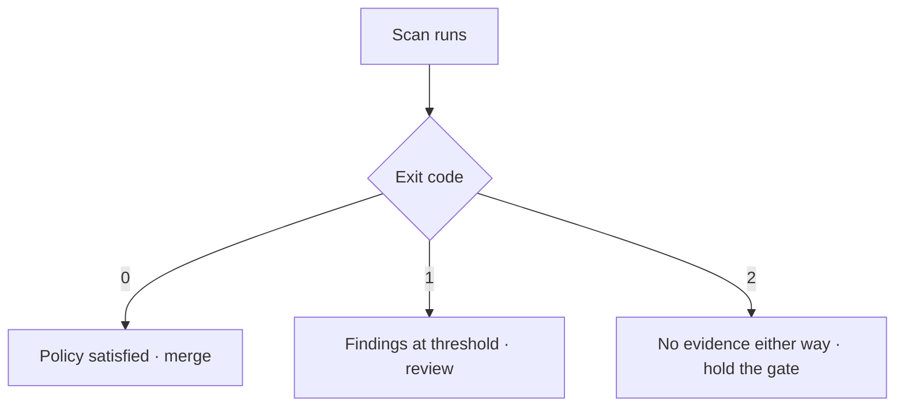

import Callout from '@/components/mdx/Callout.astro'

The [main article](/notes/codex-security-precision-gap/) argues that precision is
the number nobody published. This companion assumes you decided to adopt anyway —
which is reasonable — and covers the part that determines whether the rollout
survives contact with your team.

Everything here comes from the published CLI reference. None of it is a
benchmark claim.

## Requirements

Node.js 22 or later, and **Python 3.10 or later** — the Python dependency is not
optional and is needed for scanning and exports, which surprises people who
assume an npm package is self-contained.

Authentication is ChatGPT sign-in for humans and an environment variable for
automation: `OPENAI_API_KEY`, `CODEX_API_KEY` or `CODEX_ACCESS_TOKEN`. Use
`--auth api-key` in CI so a stale interactive session cannot silently change
which identity a pipeline runs as. For headless machines there is
`login --device-auth`.

## Exit codes are the integration surface

This is the part to get right first, because everything else in your pipeline
keys off it.

| Code  | Meaning                                                |
| ----- | ------------------------------------------------------ |
| `0`   | Completed, and policy was satisfied                    |
| `1`   | Findings at or above the configured severity threshold |
| `2`   | Input or runtime error, **or incomplete coverage**     |
| `130` | Interrupted (Ctrl-C)                                   |
| `143` | Terminated (SIGTERM)                                   |

The one that will bite you is `2`. It conflates "the tool broke" with "the scan
did not fully cover the target" — and scans report coverage as `complete`,
`partial` or `unknown`. A job that treats `2` as infrastructure flake and retries
will happily paper over a scan that silently examined a fraction of your code.



<Callout type="warn" title="Exit code 2 is not a pass">
  Treat `2` as an **unknown result**. If you are gating merges, an incomplete
  scan holds the gate exactly as a finding would — you have no evidence either
  way, and a retry that swallows it converts "we did not look" into "we found
  nothing".
</Callout>

## Start in report-only mode

`--fail-on-severity` accepts `critical`, `high`, `medium` or `low`, and it is the
switch that turns a scanner into a blocker.

Do not set it on day one. Run the scan, export the findings, and let the pipeline
pass regardless while you measure how much of the output is real. This is the
same precision measurement the main article argues for, except it costs you
nothing extra because the scan is running anyway.

```bash
npx @openai/codex-security scan . \
  --output-dir "$RUNNER_TEMP/codex-security" \
  --max-cost 5
```

Once you have a few weeks of data, raise the gate from the top down. `critical`
first. Nobody's first experience of a new security tool should be a blocked
release over a medium-severity finding in a file they did not touch.

## Scan the diff, not the world, on pull requests

Full-repository scans are for scheduled runs. On a pull request, scan what
changed:

```bash
npx @openai/codex-security scan . --diff "origin/${BASE_REF}"
```

`--working-tree` covers staged and unstaged changes locally, and `install-hook`
wires the same check into a pre-commit hook. Note that diff and working-tree
scans require the repository argument to be the git worktree root — passing a
subdirectory fails rather than scoping.

`--mode deep` performs a broader review but **does not support diff or
working-tree targets**. Deep mode is a nightly or weekly job against the whole
repository, not something you put on the merge path.

## Cost is a first-class flag, and that is a warning

`--max-cost` takes a dollar figure. The existence of that flag tells you the
default configuration — `gpt-5.6-sol` at `xhigh` effort — is expensive enough
that unbounded scanning is a real risk.

Read the documented caveat carefully: **requests already in progress can finish
above the limit.** It is a ceiling with overshoot, not a hard stop. Set it below
what you are actually willing to spend.

The five effort levels — `minimal`, `low`, `medium`, `high`, `xhigh` — are the
other lever. `xhigh` is the default, which means the out-of-the-box configuration
is the most expensive one. A per-pull-request diff scan at a lower effort with a
nightly `xhigh` deep scan is the shape most teams will land on.

For fleet-wide work, `bulk-scan` takes a CSV with `id`, `repository` and
`revision` columns and runs `--workers 4` by default. Raise it deliberately;
the cost ceiling is per scan, not per bulk run.

## The output directory is a sensitive artifact

Scan results contain **source excerpts and vulnerability details**. That is a
file describing how to exploit your product, in prose, with code.

Three consequences:

- **Write it outside the repository.** `--output-dir` pointing anywhere inside
  the working tree is how that file eventually gets committed. Use the runner
  temp directory.
- **Do not attach it as a public CI artifact.** On a public repository, build
  artifacts are downloadable by anyone.
- **Give it a retention policy,** which the documentation explicitly recommends.

Export to SARIF for dashboards — `export --format sarif` — and let the security
platform hold the detail under its own access control rather than leaving copies
in CI storage.

```bash
npx @openai/codex-security export \
  --format sarif \
  --output-dir "$RUNNER_TEMP/codex-security"
```

## Separate finding, validating and fixing

`scan`, `validate` and `patch` are distinct commands, and keeping them distinct
is the right instinct.

`validate` rechecks candidate findings against current code, which is what you
want when triaging a backlog — a finding raised three weeks ago may already be
fixed. `patch` generates remediation. Neither should run unattended on the merge
path. A generated patch is a proposal; it needs the same review as any other
change, and arguably more, because it arrives with an implicit claim of security
correctness.

`scans compare` and `scans match` diff results across runs, which is how you
answer "did this pull request introduce anything new" without re-reading the
whole backlog.

## Record false positives properly

`findings false-positive` marks a finding as not applicable with a written
reason, and the decision persists across future scans **without suppressing the
underlying rule**.

Use it, and require the reason to be a real one. The alternative — teams
disabling whole rule categories to quiet the noise — is how an organisation goes
blind to an entire vulnerability class while its dashboard stays green.

`--knowledge-base` accepts architecture and threat-model documents. If you have a
written threat model, this is the highest-leverage input available: it is the
difference between a scanner that flags every deserialisation call and one that
knows which of them are reachable from an untrusted boundary.

## A reasonable first rollout

1. Report-only diff scans on pull requests, no severity gate, output to runner
   temp, `--max-cost` set low.
2. Weekly deep scan of the full repository, results exported to SARIF.
3. After a month, count confirmed findings against total findings. That is your
   precision number, on your code.
4. Turn on `--fail-on-severity critical` only if that ratio justifies it.
5. Feed the threat model in via `--knowledge-base` and measure whether the ratio
   improves.

Step 3 is the one people skip, and it is the only step that tells you whether any
of the rest was worth doing.
