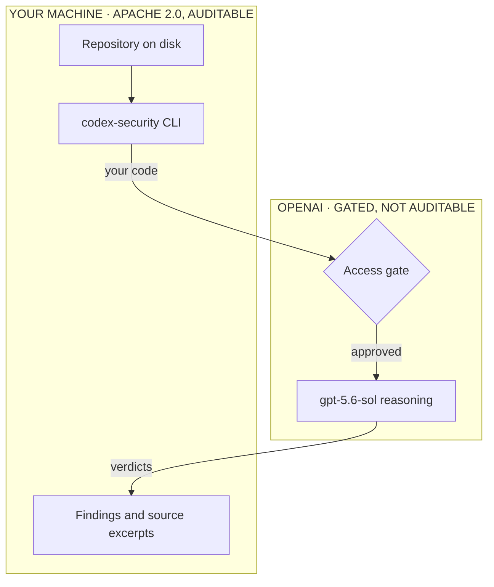

import BenchmarkBars from '@/components/mdx/BenchmarkBars.astro'
import Callout from '@/components/mdx/Callout.astro'

On 29 July 2026, OpenAI released **Codex Security** — a CLI and TypeScript SDK
for finding, validating and fixing vulnerabilities — under Apache 2.0. It had
been running since March as a research preview under the name Aardvark, and the
headline number that travelled with it is genuinely striking: **92% of known and
synthetically-introduced vulnerabilities found** on benchmark repositories, plus
3,000 critical vulnerabilities fixed by April and ten CVEs disclosed in
open-source projects.

The repository passed 8,000 stars in under a month. I went looking for the
methodology behind the 92%, and what I found was not a flaw. It was an absence.

**The number is recall. The number that decides whether you can use the tool is
precision, and precision was never published.**

## What it actually is

Before the argument, the architecture — because most write-ups got this wrong in
both directions.

The CLI runs on your machine and scans repositories that are already on disk.
But the reasoning is not local. It calls a hosted model — `gpt-5.6-sol` at
`xhigh` reasoning effort by default — and **running scans requires Codex Security
access**, which is gated. Full-repository scans may additionally require what
the docs call Trusted Access for Cyber.

So the accurate description is narrower than either the press release or the
backlash. What is Apache 2.0 is the CLI, the SDK, the Docker harness and the
orchestration. What is closed is the thing that decides whether a finding is a
finding. You can read every line of how your code is gathered, chunked and
submitted. You cannot read, run or audit the part that reasons about it.

That distinction matters more than the licence argument it usually gets reduced
to. It means the interesting property of this tool — its judgement — is not
reproducible by you, and its error profile is whatever OpenAI's evaluation says
it is.

Which brings us to the evaluation.

## Where 92% comes from

Recall answers one question: _of the vulnerabilities that exist, how many did the
scanner find?_ On golden repositories seeded with known and deliberately
introduced bugs, Codex Security found 92 out of every 100.

That is a real result and a hard one. It is also, on its own, unfalsifiable as a
usability claim, because you can score 100% recall by reporting that every line
of the codebase is vulnerable.

The complementary question is precision: _of the things the scanner reported, how
many were real?_ Recall measures what you catch. Precision measures what you have
to wade through to get it. Ship a scanner at 92% recall and 20% precision into a
monorepo and you have handed your security team four false alarms for every true
one — indefinitely, on every commit.

Two further things about the 92% are worth holding.

It includes **synthetically-introduced** vulnerabilities. Injected bugs are
easier than organic ones: they tend to be locally contained, idiomatic in shape,
and unentangled from the surrounding architecture. Real vulnerabilities are
frequently emergent — a safe function called with attacker-influenced state three
layers up. Any recall figure that blends the two overstates performance on the
second kind.

And it is measured on repositories chosen for the benchmark. Your codebase was
not.

## What independent benchmarks actually found

Here the story turns, and it turns against the easy narrative rather than for it.

[RealVuln](https://arxiv.org/abs/2604.13764) (Pellew and Raza, March 2026)
evaluated 15 scanners across 26 vulnerable Python repositories with **796
hand-labelled findings — 676 real vulnerabilities and 120 deliberate
false-positive traps**. The trap set is the part that matters: it exists
specifically to catch tools that pattern-match their way to high recall.

The precision results:

<BenchmarkBars
  label="Scanner"
  metric="Precision"
  scale="1.0 = every finding is real · 0.0 = every finding is noise"
  caption="Precision on RealVuln, 26 vulnerable Python repositories, 796 hand-labelled findings."
  rows={[
    { label: 'Claude Sonnet 4.6', note: 'General-purpose LLM', value: 0.785 },
    { label: 'Gemini 3.1 Pro', note: 'General-purpose LLM', value: 0.774 },
    { label: 'SonarQube', note: 'Rule-based SAST', value: 0.611 },
    { label: 'SecLab Agent', note: 'Security-specialised', value: 0.605 },
    { label: 'Snyk', note: 'Rule-based SAST', value: 0.282 },
    {
      label: 'Semgrep',
      note: 'Rule-based SAST — the incumbent',
      value: 0.205,
      emphasis: true,
    },
  ]}
/>

I expected this table to indict the LLMs. It does the opposite. **General-purpose
models were roughly three times more precise than the rule-based SAST tools the
industry has run for a decade.** On classes that require actually understanding
what the code does, the recall gap is wider still: SQL injection at 95% versus
32%, command injection at 83% versus 24%.

Semgrep at 0.205 precision means four out of every five findings are noise. That
is the incumbent. That is what teams already tolerate.

So the honest framing is not "AI scanners are noisy." It is: **AI scanners appear
to be a large improvement over a baseline that was very bad, and Codex Security
declined to report where it lands on the axis where that improvement would show
up.**

The second paper sets the range.
[Are Frontier LLMs Ready for Cybersecurity?](https://arxiv.org/abs/2605.23243)
(Dahiya et al., revised June 2026) tested eight models and found **every frontier
model producing 10–50% false positive rates** in white-box detection,
systematically over-predicting vulnerabilities. Their best domain-specialised
model reached 0.904 precision at a 9.7% false positive rate. Their stated
motivation is the same gap: prior benchmarks did not report false positive rates,
and that is the metric that determines real-world usability.

A 10% false positive rate and a 50% false positive rate are the difference
between a tool your team trusts and a tool your team silences. Codex Security
could be at either end. Nothing published tells you which.

## Why this is the whole game

If you think a noisy scanner is merely annoying, look at what it did to curl.

curl ran a bug bounty through HackerOne from April 2019. By 2025, LLM-generated
reports — long, confident, superficially plausible, and fabricated — had
overwhelmed a seven-person volunteer security team. Daniel Stenberg's numbers:
the **confirmed-vulnerability rate fell from above 15% to below 5%**, with
roughly one in five submissions being outright slop. Each bogus report still cost
hours, because you cannot dismiss a security claim without reading it.

In early 2026 curl shut the programme down. It reopened about a month later when
report quality recovered, but volume kept climbing.

Stenberg's own framing was that AI slop is a denial-of-service attack on open
source. That is the correct mental model, and it generalises directly to your CI
pipeline. **False positives in security tooling do not degrade gracefully.** They
consume the scarcest resource on the team — expert attention — and when that
runs out, people stop reading the findings. A scanner that is ignored has
negative value, because it still carries the assurance that something is being
checked.

This is also why one small design detail in the CLI is more reassuring than any
benchmark. `findings false-positive` lets you mark a finding as not applicable
with a written reason, and **the decision persists across future scans without
suppressing the underlying rule**. That is not a convenience feature. It is an
admission, in code, that false positives are the operational problem — and it is
built the right way, since suppressing the rule is how teams accidentally go
blind to a whole vulnerability class.

Somebody on that team understands the actual failure mode. It makes the missing
metric more conspicuous, not less.

## What the open-sourcing gets you

Concretely, and worth separating from the debate about whether the label fits.

**You get:** the ability to audit what leaves your machine, run the scanner in
your own containers, wire it into CI with your own policy, keep results in
infrastructure you control, and fork the orchestration if it does not fit. For
regulated environments that is not nothing — data flow is the question compliance
actually asks, and now it is answerable by reading the code.

**You do not get:** the ability to run it without OpenAI's approval, reproduce
its results, evaluate it before requesting access, or continue using it if the
terms change. The scanning intelligence is a hosted dependency with a gate in
front of it.

<Callout type="warn" title="Scan output is a sensitive artifact">
  A caveat the docs raise and most coverage skipped: results contain **source
  excerpts and vulnerability details**. Point `--output-dir` inside the
  repository and you will eventually commit a file describing exactly how to
  exploit your own product. Keep it outside the tree, with a retention policy —
  the wiring is in the [CI integration
  companion](/notes/codex-security-precision-gap/ci-integration/).
</Callout>

## What I would actually do

- **Take the trial seriously, and design it as a measurement.** Access is gated,
  so you get one shot at a first impression. Do not spend it on a repository you
  already know is clean.
- **Measure precision yourself, because nobody else has.** Run it over a
  repository whose vulnerability history you know — one with resolved CVEs and
  audited commits. Count confirmed findings against total findings. That single
  ratio tells you more than the 92% does.
- **Include a false-positive trap set.** RealVuln's design is worth stealing:
  seed code that looks vulnerable and is not. A scanner's behaviour on deliberate
  near-misses is the best available proxy for its behaviour on your real code.
- **Compare against the baseline you actually run,** not against perfection. If
  Semgrep is giving you 0.205 precision today, a scanner at 0.6 is a large win
  even though it is far from clean.
- **Budget the review time before you enable it in CI.** At any plausible
  precision, someone is reading findings that turn out to be nothing. Decide who,
  and how long, before the first pull request is blocked.

The thing worth taking away is not that Codex Security is overhyped — on the
evidence available it is a strong tool, and the independent literature is kinder
to this class of scanner than I expected going in.

It is that **a 92% recall figure, published without its precision counterpart, is
half a measurement presented as a whole one**. The half that was published is the
half that sells. The half that was not is the half that determines whether your
team is still reading the output in six months.

Ask for that number when you request access. If it exists, it is the most useful
thing they could tell you.
